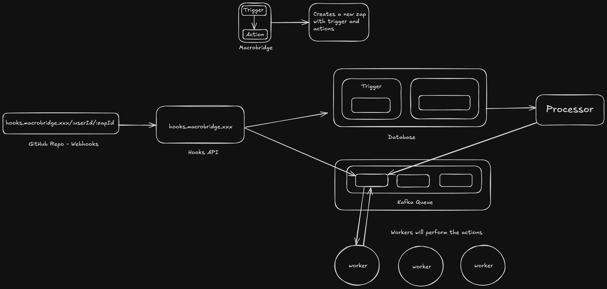

# Marcobridge


A powerful automation platform that connects webhooks, email notifications, and Solana blockchain integration.

## Features
- Webhooks: Trigger events and actions programmatically.
- Email Notifications: Automate sending and receiving emails.
- Solana Integration: Utilize Solana blockchain for decentralized operations.
- Scalable Architecture: Powered by Kafka for message streaming.
- Full-Stack Solution: Built using Next.js, Node.js, and Express for both frontend and backend functionalities.
- Database Management: Prisma ORM integrated with PostgreSQL for efficient data handling.

## Getting Started
### Prerequisites
Ensure the following tools are installed on your system:
- Node.js (v18 or later)
- npm (Node package manager)
- Docker (for containerized environment)
- Kafka (for message brokering)

### Installation

1. **Clone the repository**
   ```bash
   git clone https://github.com/pulkitgarg04/macrobridge.git
   cd macrobridge
   ```

2. **Set up environment variables**
Copy the contents of the `.env.example` file to `.env` file and update the placeholder values with your actual configuration.

   ```bash
   cp client/.env.example client/.env
   cp server/.env.example server/.env
   cp processor/.env.example processor/.env
   cp worker/.env.example worker/.env
   ```

3. **Install dependencies**
   ```bash
   cd client && npm install
   cd ../server && npm install
   cd ../processor && npm install
   cd ../worker && npm install
   cd ../hooks && npm install
   ```


4. **Configure database**
   ```bash
   cd hooks
   npx prisma generate
   npx prisma migrate dev
   
   cd ../server
   npx prisma generate
   npx prisma migrate dev

   cd ../processor
   npx prisma generate
   npx prisma migrate dev

   cd ../worker
   npx prisma generate
   npx prisma migrate dev
   ```

6. **Start kafka**:
   ```bash
   docker run -p 9092:9092 apache/kafka:4.0.0
   ```

   - Then, access the Kafka container:
      ```bash
      docker exec -it <container_id> /bin/bash
      ```

   - Create a topic named zap-events:
      ```bash
      cd /opt/kafka/bin
      ./kafka-topics.sh --create --topic zap-events --bootstrap-server localhost:9092
      ```

5. **Run the servers**
   ```bash
   # Terminal 1: Start frontend
   cd client
   npm run dev
   
   # Terminal 2: Start backend
   cd server
   tsc -b
   npm run start
   
   # Terminal 3: Start processor
   cd processor
   tsc -b
   npm run start
   
   # Terminal 4: Start worker
   cd worker
   tsc -b
   npm run start

   # Terminal 5: Start hooks
   cd hooks
   tsc -b
   npm run start
   ```

7. Access the application at [http://localhost:3000](http://localhost:3000)

## Workflow


## License
This project is licensed under the MIT License - see the [LICENSE](LICENSE) file for details.